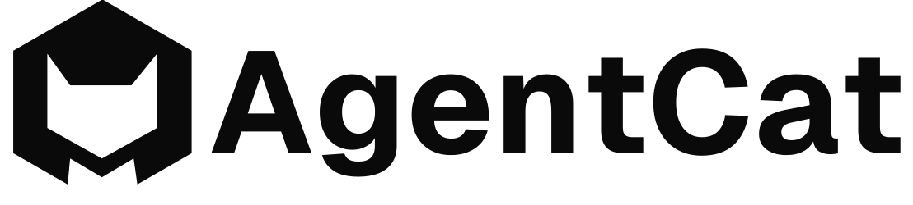

<div align="center">
  <picture>
    <source media="(prefers-color-scheme: dark)" srcset="docs/static/logo-dark.svg">
    <source media="(prefers-color-scheme: light)" srcset="docs/static/logo-light.svg">
    
  </picture>
</div>
<h3 align="center">
    <a href="#why-use-agentcat-">Features</a>
    <span> · </span>
    <a href="https://agentcat.com">Website</a>
    <span> · </span>
    <a href="https://docs.agentcat.com">Docs</a>
    <span> · </span>
    <a href="#free-for-open-source">Open Source</a>
    <span> · </span>
    <a href="https://discord.gg/n9qpyhzp2u">Discord</a>
</h3>
<p align="center">
  <a href="https://badge.fury.io/py/agentcat"></a>
  <a href="https://pypi.org/project/agentcat/"></a>
  <a href="https://opensource.org/licenses/MIT"></a>
  <a href="https://badge.fury.io/js/agentcat"></a>
  <a href="https://www.npmjs.com/package/agentcat"></a>
</p>

> [!IMPORTANT]
> **MCPcat is now AgentCat** 🐱 — same team, same product, new name. The old `mcpcat` packages keep working forever, but new features land in `agentcat`.

AgentCat is an analytics platform for MCP server owners 🐱. It captures user intentions and behavior patterns to help you understand what AI users actually need from your tools — eliminating guesswork and accelerating product development all with one-line of code.

🎉 AgentCat now offers open source support for existing observability platforms, like [OpenTelemetry](https://opentelemetry.io/), [Datadog](https://www.datadoghq.com/), and [Sentry](https://sentry.io/). Contribute or message us to add support for yours today 🎉

```bash
pip install agentcat
```
Checkout the [Python SDK here](https://github.com/agentcathq/agentcat-python-sdk).

```bash
npm install agentcat
```
Checkout the [TypeScript SDK here](https://github.com/agentcathq/agentcat-typescript-sdk).

```bash
go get github.com/mcpcat/mcpcat-go-sdk
```
Checkout the [Go SDK here](https://github.com/mcpcat/mcpcat-go-sdk).

Create an account for free today at [agentcat.com](https://agentcat.com).

## Why use AgentCat? 🤔

AgentCat helps developers and product owners build, improve, and monitor their MCP servers by capturing user analytics and tracing tool calls.

Use AgentCat for:

- **User session replay** 🎬. Follow alongside your users to understand why they're using your MCP servers, what functionality you're missing, and what clients they're coming from.
- **Trace debugging** 🔍. See where your users are getting stuck, track and find when LLMs get confused by your API, and debug sessions across all deployments of your MCP server.
- **Existing platform support** 📊. Get logging and tracing out of the box for your existing observability platforms (OpenTelemetry, Datadog, Sentry) — eliminating the tedious work of implementing telemetry yourself.


## Supported MCP SDKs

| SDK | Version | Status |
|-----|---------|--------|
| 🟦 [TypeScript](https://github.com/agentcathq/agentcat-typescript-sdk) | MCP v1.0.0+| ✅ Available |
| 🐍 [Python](https://github.com/agentcathq/agentcat-python-sdk) | MCP v1.2.0+| ✅ Available |
| 🐹 [Go](https://github.com/mcpcat/mcpcat-go-sdk) | mcp-go v0.44.0+ | ✅ Available |
| ☕ Java | - | 🚧 Roadmap |

## Supported Observability Platforms

  | Platform | Version | Status |
  |----------|---------|--------|
  | 📊 [OpenTelemetry](https://opentelemetry.io/) | v1.0.0+ | ✅ Available |
  | 🐕 [Datadog](https://www.datadoghq.com/) | v2.0.0+ | ✅ Available |
  | 🔍 [Sentry](https://sentry.io/) | v7.0.0+ | ✅ Available |

Since AgentCat supports OpenTelemetry, check to see if your existing vendor or platform is already [supported](https://opentelemetry.io/ecosystem/vendors/)!

## Free for open source

AgentCat is free for qualified open source projects. We believe in supporting the ecosystem that makes MCP possible. If you maintain an open source MCP server, you can access our full analytics platform at no cost.

**How to apply**: Email hi@agentcat.com with your repository link

_Already using AgentCat? We'll upgrade your account immediately._

## Community Cats 🐱

Meet the cats behind AgentCat! Add your cat to our community by submitting a PR with your cat's photo in the `docs/cats/` directory.

<div align="left">
  
  
</div>

_Want to add your cat? Create a PR adding your cat's photo to `docs/cats/` and update this section!_
